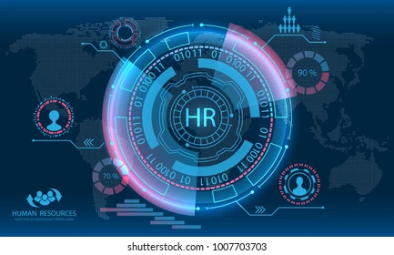
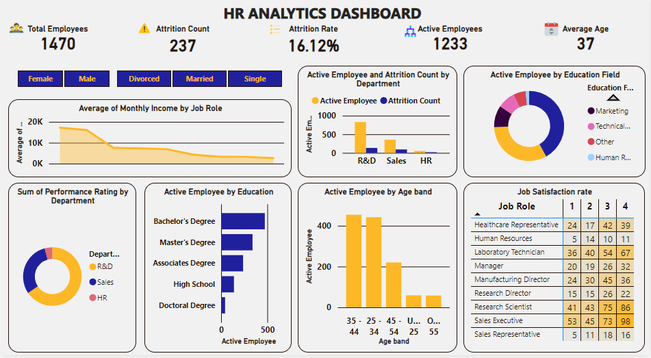

# Comprehensive-HR-Analysis-and-Insights-Attrition-Performance-and-Employee-Satisfaction
---
### 1. Executive Summary
This report provides insights from the HR analysis conducted using Power BI, focusing on key areas such as employee attrition, department performance, job satisfaction, and income trends. The dataset consists of 1,470 employees, with an attrition rate of 16.12% and 1,233 active employees. The analysis includes data visualized through clustered column charts, doughnut charts, area charts, and bar charts to highlight the relationships between various factors.]

---
### 2. Key Findings
- Total Employees: 1,470
- Attrition Rate: 16.12% (237 employees)
- Active Employees: 1,233 employees
- Average Age: 37 years
---
3. Departmental Insights
- Attrition by Department: The R&D department had the highest attrition rate, followed by Sales and HR. This was visualized using a clustered column chart.
- Performance Rating by Department: R&D leads in performance, followed by Sales and HR. This was represented using a doughnut chart.
- Job Role and Monthly Income: An area chart was used to determine the average monthly income by job role, showing disparities across roles.
4. Demographic Insights
- Employee Age Distribution: The largest age group is between 35-44 years, followed by 25-34, as visualized by a bar chart.
- Education Field: Active employees' distribution by education field was visualized using a doughnut chart.
- Job Satisfaction: A matrix table was used to assess job satisfaction by department and job role.

### Slicers:
The analysis used gender and marital status as slicers, allowing insights based on:
Gender: Male and Female
Marital Status: Single, Married, and Divorced
---
### 3. Visualizations Summary
- Clustered Column Chart: Used to visualize active employees and attrition count by department.
- Doughnut Charts: Visualized performance ratings by department and education field of active employees.
- Area Chart: Showcased the average monthly income by job role.
- Bar Chart: Illustrated active employees by age band.
- Matrix Table: Used for job satisfaction assessment.
### 4. Recommendations
- Address Attrition in R&D:
Since the R&D department has the highest attrition rate, further investigation into potential causes (e.g., work environment, job satisfaction, or compensation) is recommended. Offering retention incentives, such as career development programs or improved work-life balance options, may help reduce turnover.

- Targeted Retention Efforts for Key Departments:
Sales and HR also show high attrition rates. Developing department-specific retention strategies, such as improved employee engagement initiatives or enhanced benefits, may lower attrition rates in these critical departments.

- Focus on Employee Satisfaction:
The job satisfaction matrix highlights areas for improvement. Departments with lower satisfaction should be prioritized for engagement surveys, focus groups, and action plans to address employee concerns.

- Address Income Disparities Across Job Roles:
The area chart of monthly income by job role shows disparities that could lead to dissatisfaction. A salary review could help ensure fairness and maintain employee morale.

- Foster Career Development for Young Employees:
With the majority of employees falling in the 35-44 age range, the company should consider offering mentorship and career development programs to younger employees in the 25-34 age group to enhance retention and prepare them for leadership roles.

- Monitor Gender and Marital Status Trends:
Use the gender and marital status slicers to develop personalized strategies to address any emerging trends in attrition or dissatisfaction specific to these groups.

### 5. Conclusion
The HR analysis has provided valuable insights into the company’s workforce. By focusing on the identified areas, particularly attrition, job satisfaction, and income disparities, the company can take actionable steps to improve employee retention, morale, and overall productivity.

See the dashboard below

